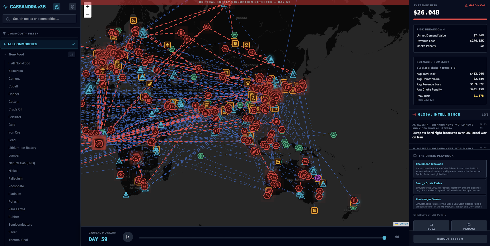

# Project Cassandra



Project Cassandra is a digital twin of the global commodities supply chain. It models physical flows, market dynamics, and geopolitical shocks across 30+ commodities in an interactive map-based simulation.

**Status:** Active (Cassandra v2)  
**Stack:** FastAPI (Python) + React/Vite (TypeScript) + Leaflet

## Highlights
- Multi-commodity topology with 800+ real-world nodes across extraction, processing, logistics, and retail
- Scenario engine for blockages, strikes, and embargoes
- Deterministic logistics with sea-lane routing and vessel movement
- Systemic risk model (hybrid: unmet demand value + revenue loss + chokepoint penalties)
- Live market price bootstrapping (Yahoo Finance)

## Architecture (v2)

**Backend:** `cassandra_v2/backend`  
**Frontend:** `cassandra_v2/frontend`

Core backend modules:
- `app/simulation/world.py`: Orchestrates the simulation tick loop
- `app/engines/physics.py`: Transformation recipes and constraints
- `app/engines/logistics.py`: Sea-lane routing and vessel movement
- `app/engines/finance.py`: Pricing, demand destruction, margin logic
- `app/engines/compliance.py`: Sanctions and compliance checks
- `app/services/loader.py`: Loads topology, actors, and infrastructure

Core frontend modules:
- `src/App.tsx`: Main UI state, map rendering, and simulation control
- `src/components/*`: Scenario control, inspection panel, risk dashboard

## Quickstart

Backend:
```bash
cd cassandra_v2/backend
python -m venv venv
source venv/bin/activate
pip install -r requirements.txt
uvicorn main:app --reload --port 8002
```

Frontend:
```bash
cd cassandra_v2/frontend
npm install
npm run dev -- --port 5174
```

Open:
- Frontend: `http://localhost:5174`
- API docs: `http://localhost:8002/docs`

## Configuration

Backend config is in:
- `cassandra_v2/backend/app/core/config.py`

Key knobs:
- Systemic risk weights and chokepoint penalties
- Chokepoint flow fractions (real-world calibration)

## Systemic Risk (Hybrid Model)
Systemic Risk is computed per day as:

```
Risk = unmet_demand_value + revenue_loss + chokepoint_penalty
```

You can tune:
- `SYSTEMIC_RISK_UNMET_WEIGHT`
- `SYSTEMIC_RISK_REVENUE_WEIGHT`
- `SYSTEMIC_RISK_CHOKE_PENALTY`
- `SYSTEMIC_RISK_CHOKE_IMPACTS`
- `SYSTEMIC_RISK_CHOKE_FLOW_FRACTION`
- `SYSTEMIC_RISK_CHOKE_MACRO_MULTIPLIER`

## Scenarios

The API supports injected scenarios:
- `blockage` (e.g., choke points like Hormuz)
- `strike` (node capacity reduction)
- `embargo` (commodity restrictions)

Playbook scenarios are defined in:
- `cassandra_v2/backend/app/simulation/playbook.py`

## Data

Topology data lives in:
- `cassandra_v2/backend/data/topology/food`
- `cassandra_v2/backend/data/topology/non_food`

Sea lanes and infrastructure:
- `cassandra_v2/backend/data/logistics`

Actors:
- `cassandra_v2/backend/data/actors/global_actors.json`

## Development Notes
- The simulation defaults to **90 days** per run.
- Real-world price bootstrap uses `yfinance`; missing tickers fall back to defaults.
- For open source, avoid committing logs, venvs, and node_modules (see `.gitignore`).

## Roadmap (Short Term)
- Dynamic chokepoint impact model across oil + LNG + refined products
- Multi-user multiplayer simulation mode
- A* maritime routing with land avoidance
- Narrative AI layer for compliance and risk summaries

## License
TBD. Add a LICENSE file before publishing.
